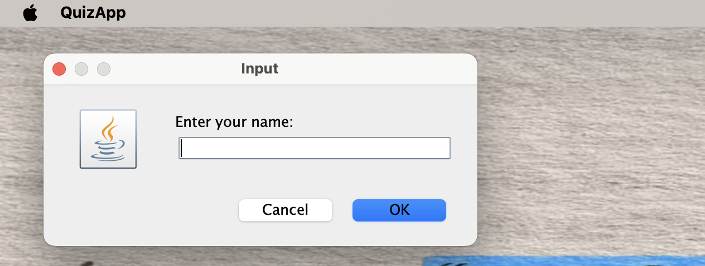
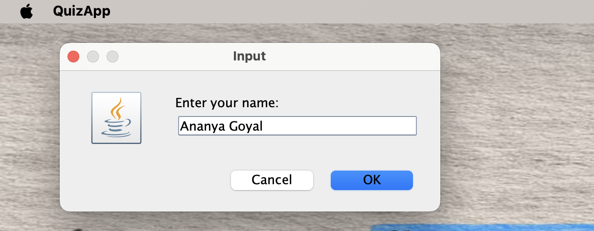
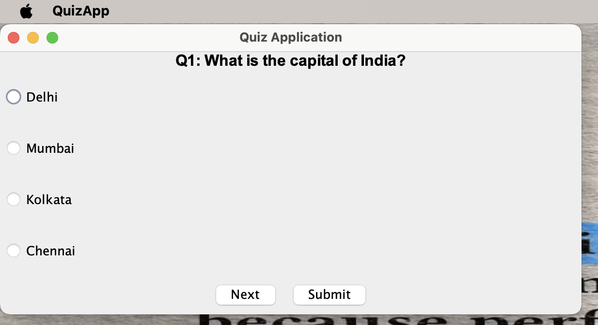
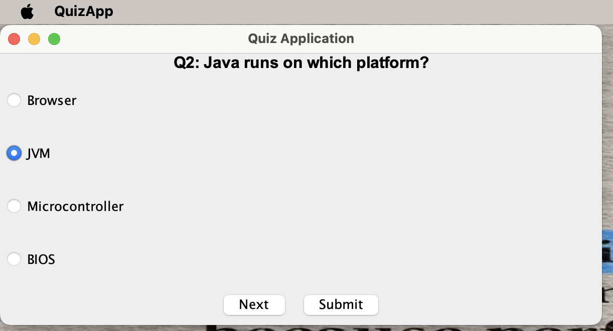
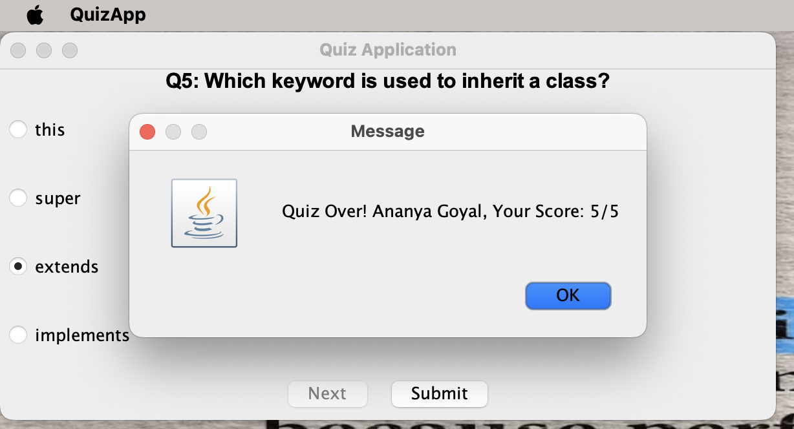

# 📚 Java QuizApp using Object-Oriented Programming (OOP)

This is a simple and effective **Java-based Quiz Application** developed using core **Object-Oriented Programming (OOP)** principles. It's designed as a GUI app where users can answer multiple-choice questions and view their score. Great for practicing Java fundamentals!

---

## 🚀 Features

- ✅ GUI-based multiple-choice quiz
- 🧠 Built using OOP concepts (Encapsulation, Modularity)
- 💾 Saves user scores in `scores.txt`
- 🧩 Easy to extend with more questions or categories

---

## 🧱 Project Structure

Java-Project/
- assets/
 ── quiz-start.png
 ── quizStart2.png
 ── question-answer.png
 ── question-answer2.png
 ── final-score.png
- src/
 ── QuizApp.java
 ── Question.java
- scores.txt
- .gitignore
- README.md

---

## 🔧 How to Run

### ✅ Prerequisites

- Java JDK (8 or higher)
- Terminal / Command Prompt

### 🛠️ Compilation and Execution

bash
cd src
javac *.java
java QuizApp

---

## 📸 GUI Screenshots

### 🧑 Name Input (with entry)

### ⚠️ Empty Name Prompt

### 📝 Question 1 – Capital of India

### 💡 Question 2 – Java Platform

### 🏁 Final Score Display

🙋‍♀️ About the Author
Ananya Goyal
📬 LinkedIn (https://www.linkedin.com/in/ananya-goyal-824690288/)
